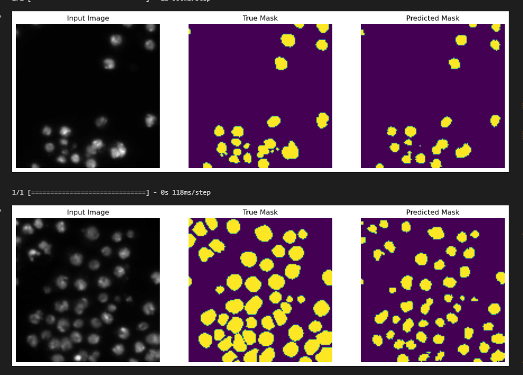

# Image Segmentation for Identifying Nuclei in Microscopy Images Using Deep Learning Model
 Image segmentation of cell nuclei

## Project description

An algorithm that can automatically detect nuclei to expedite research on a wide range of diseases, including cancer, heart disease, and rare disorders. Such tool has the potential to significantly improve the speed at which cures are developed, benefiting those suffering from various health conditions, including chronic obstructive pulmonary disease, Alzheimer's, diabetes, and even the common cold.
Hence, the identification of cell nuclei is a crucial first step in many research studies because it enables researchers to analyze the DNA contained within the nucleus, which holds the genetic information that determines the function of each cell. By identifying the nuclei of cells, researchers can examine how cells respond to different treatments and gain insights into the underlying biological processes at play. An automated AI model for identifying nuclei, offers the potential to streamline drug testing and reduce the time for new drugs to become available to the public.
Thus, you as an AI engineer working in a biomedical company are tasked to create a model for semantic segmentation for images containing cell neuclei..

These are steps used to complete this project.
 
#### 1. Data Loading
> loaded and processes training and testing data from a specified directory. The training and testing data consist of pairs of microscopy images and corresponding masks (labeled images indicating the location of nuclei). 

 

 

 

 

#### 2. Data Pre-processing
> The images and masks are loaded using the cv2 module and are then converted to numpy arrays.

 

#### 3. Model Development and Training
>  model for image segmentation using the pix2pix model from tensorflow_examples and MobileNetV2 from keras.applications.  

> Compile model using an Adam optimizer, a Sparse Categorical Crossentropy loss function with IoU and accuracy as a metric.

> Creates a set of callbacks, including a TensorBoard callback to write log files, an early stopping callback to stop training when the validation loss stops improving, and a learning rate scheduler callback to decrease the learning rate as the number of epochs increases.

 

#### 4. Model Evaluation
> Evaluates the model on the validation set and displays the results.
> Generate plots showing the model's performance during training.
> Saved The model

## Results

    
    
     The model accuracy is at 96%, with a loss of 0.09 and IoU of 0.77
     

 
 

 

    
    TensorBoard graph showed minimal overfitting
    
## Acknowledgement
> The dataset used for this project is by *[Booz Allen Hamilton](https://www.kaggle.com/competitions/data-science-bowl-2018/overview)*
